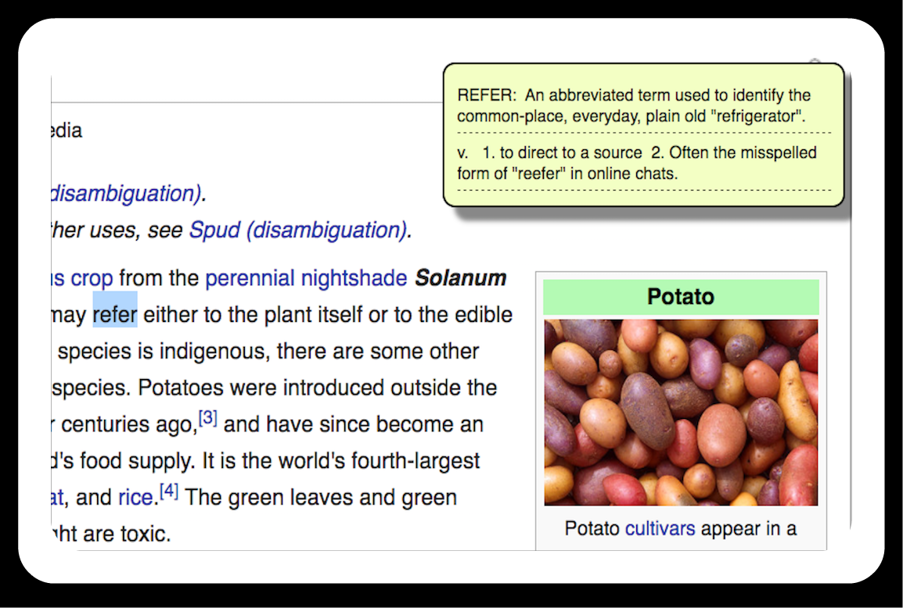

# Ductionary

[Ductionary live][chrome]

[chrome]: https://chrome.google.com/webstore/detail/ductionary/dkndfbdehdblfaldfkgjclcahpaoefci?authuser=1

**Ductionary** is an extremely useful chrome extension that allows users to look up word definitions instantly.
It uses 'Urban Dictionary' as a source to retrieve informations.
To look up a word, simply double click on any word on the web page while holding down 'Alt' key (or 'Option' key for Mac users). A small window will pop out with definitions.

*Note : All web pages opened before installing this extension will need a refresh for it to work. Also, it will not work on chrome app store page (in fact, non of the extensions will).

## Features

### Easy Installation
- Simply click on 'Add extension' in the installing page(link above)!

### Provide Definitions

- Gives user definitions of any word they choose while browsing on internet!

